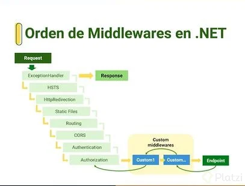
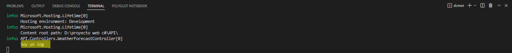
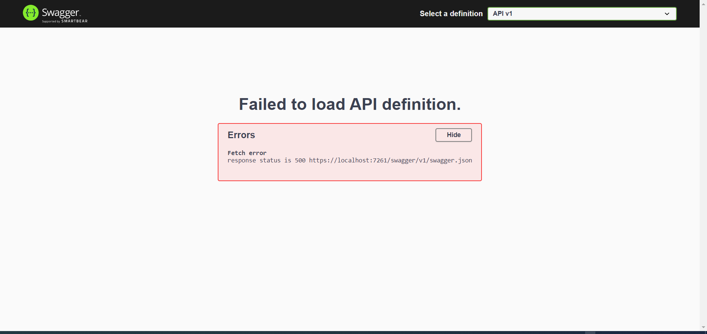

# API con C#

>NOTA: para este proyecto vamos a usar postman, VSCode y SQL Server

Antes de comenzar hablemos de un tema en particular **Rest** (Representational State Trasfer).

Rest es un estilo de arquitectura para el diseño de paginas web ¿que significa esto? significa que tiene toda una base teorica la cual tenemos que aplicar al momento de crear nuestras aplicaciones.
Una de sus reglas es que debemos unos verbos al momento de interacutar con nuestras Apis conocido como verbos http o http verbs

- GET: Es utilizado únicamente para consultar información al servidor, muy parecidos a realizar un SELECT a la base de datos. No soporta el envío del payload
- POST: Es utilizado para solicitar la creación de un nuevo registro, es decir, algo que no existía previamente, es decir, es equivalente a realizar un INSERT en la base de datos. Soporta el envío del payload.
- PUT: Se utiliza para actualizar por completo un registro existente, es decir, es parecido a realizar un UPDATE a la base de datos. Soporta el envío del payload.
- PATCH: Este método es similar al método PUT, pues permite actualizar un registro existente, sin embargo, este se utiliza cuando actualizar solo un fragmento del registro y no en su totalidad, es equivalente a realizar un UPDATE a la base de datos. Soporta el envío del payload
- DELETE: Este método se utiliza para eliminar un registro existente, es similar a DELETE a la base de datos. No soporta el envío del payload.
- HEAD: Este método se utilizar para obtener información sobre un determinado recurso sin retornar el registro. Este método se utiliza a menudo para probar la validez de los enlaces de hipertexto, la accesibilidad y las modificaciones recientes.

Otro de los mandamientos de Rest es que debemos manejar una URL por cada uno de nuestro recurcos dentro de nuestra base de datos.

Esta url nos va a permitir realizar las acciones dentro de nuestra BD, por lo tanto no puede ser dinamica y debe indicarme cual es el recurso al que estamos apuntando por ejemplo ".../api/user/1".

Y por ultimo hablemos de las respuestas HTTP. Estas nos permite decirle al usuario que es lo que paso con nuestras consultas:
Respuestas HTTP

- Informativas 100-199
- Satisfactorias 200-299
- Redirecciones 300-399
- Error Cliente 400-499
- Error Server 500-599

Con esto en mente creemos nuestra API con .net

    dotnet new webapi

Al crear nuestra API vamos a ir a nuestro controlador y vamos a hacer algunas modificaciones simples para entender lo que estabamos hablando sobre los mandamientos Rest.

    using Microsoft.AspNetCore.Mvc;

    namespace API.Controllers;

    [ApiController]
    [Route("[controller]")]
    public class WeatherForecastController : ControllerBase
    {
        private static readonly string[] Summaries = new[]
        {
            "Freezing", "Bracing", "Chilly", "Cool", "Mild", "Warm", "Balmy", "Hot", "Sweltering", "Scorching"
        };

        private readonly ILogger<WeatherForecastController> _logger;
        List<WeatherForecast> listWF = new List<WeatherForecast>();

        public WeatherForecastController(ILogger<WeatherForecastController> logger)
        {
            _logger = logger;
            if (listWF == null || !listWF.Any())
            {
                listWF = Enumerable.Range(1, 5).Select(index => new WeatherForecast
                {
                    Date = DateTime.Now.AddDays(index),
                    TemperatureC = Random.Shared.Next(-20, 55),
                    Summary = Summaries[Random.Shared.Next(Summaries.Length)]
                })
                .ToList();
            }
        }

        [HttpGet(Name = "GetWeatherForecast")]
        public IEnumerable<WeatherForecast> Get()
        {
            return listWF;
        }

        [HttpPost]
        public IActionResult Post(WeatherForecast watherf)
        {
            listWF.Add(watherf);
            return Ok();
        }

        [HttpDelete("{index}")]
        public IActionResult Delete(int index)
        {
            listWF.RemoveAt(index);
            return Ok();
        }

    }

Como puedes ver hicimos uso de los atributos para verbos http. en el cual despues de extraer la logica que obtenia la lista con los elementos en un array. lo instanciamos en constructor para que se obtubiera cuando iniciara la aplicacion.

Luego simplemente devolvismo la lista, de esta manera presentamos el codigo de una manera un poco más amigable. Despues creamos dos metodos mas, para agregar un nuevo elemento y otro para eliminar.

Con esto podemos abrir Postman y ver el resultado que nos trae.

Ahora supongamos que queremos cambiar la ruta de nuestras api. Basta con ir a al atributo [Route("[controller]")] y cambiarlo por [Route("api/[controller]") con esto nuestra ruta cambia de GetWeatherForecast "{"localhost}/weatherforecast" a "{localhost}/api/weatherforecast"

Esto nos permitiria tener multiples rutas para cada accion, por ejemplo si agregamos en el metodo Get.

    [Route("Get/weatherforecast")]

Ahora tendremos dos ruta que nos devuelven valores.
Tambien podemos hacer rutas de formas dinamica de la misma forma que el controller, pero usando la palabra reservada Action

    [Route("[action]")]

Para comprobarlo cambiemos el nombre de nuestro metodo Get. Sabiendo lo basico de lo basico ahora podemos entrar un poco mas profundo en este tema.

## ¿Qué son los middlewares?

Es un software que se ensambla en una canalización de una aplicación para controlar las solicitudes y las respuestas. Cada componente puede hacer lo siguiente:

- Elegir si se pasa la solicitud al siguiente componente de la canalización.
- Realizar trabajos antes y después del siguiente componente de la canalización.

Los delegados de solicitudes se usan para crear la canalización de solicitudes. Estos también controlan las solicitudes HTTP. para mas informacion [aqui](https://learn.microsoft.com/es-es/aspnet/core/fundamentals/middleware/?view=aspnetcore-6.0)

 

EStos middlewares se encuentran en nuestro archivo program.cs o en versiones anteriores al 6.0 startup.cs

Este orden es importante porque algunos de ellos tienen una dependencia del anterior. por ejemplo agreguemos un Middlewares de una pagina de vienvenida.

    app.UseWelcomePage();

El codigo tiene que estar despues de la autorizacion (app.UseAuthorization()) y antes del Endpoin (app.MapControllers())

Ahora tal vez vea mejor lo que es un Middlewares, son simplemente intrucciones de codigo que se iran agregando una tras otro durante el ciclo de vida de nuestra aplicacion.

Creemos nuestro propio Middlewares para entender un poco mas el tema. Empecemos con agregar una nueva carpeta para alojar el archivo. De nombre le pondremos timeMiddleware.cs y dentro copiaremos el siguiente codigo.

    using Microsoft.AspNetCore.Http;
    public class timeMiddleware
    {
        readonly RequestDelegate next;

        public timeMiddleware(RequestDelegate nextRequest)
        {
            next = nextRequest;
        }

        public async Task Invoke(HttpContext content)
        {

            await next(content);
            if (content.Request.Query.Any(p => p.Key == "time"))
            {
                await content.Response.WriteAsync(DateTime.Now.ToLongDateString());
            }
        }
    }

    public static class TimeMiddlewareExtension
    {
        public static IApplicationBuilder UseTimeMiddleware(this IApplicationBuilder builder)
        {
            return builder.UseMiddleware<timeMiddleware>();
        }
    }

La logica es simple con RequestDelegate vamos a invocar el Middleware que sigue. En el contructor hacemos el llamado al siguiente Middleware.

Despues creamos un metodo asincrono llamado Invoke que esta en todo los Middlewares y dentro vamos a hacer un analices sobre ese request y ver si dentro existe algun parametro que tenga la palabra "time". Si existe devolvemos la fecha actual.

Por ultimo crearemos una nueva clase que nos va a permitir agregar el Middleware en nuestro archivo Program.cs.

Ahora podemos ir a Postman a ver el resultado ¿como? colocando la direccion de esta manera {localhost}/?time

Ahora para entender la improtancia del orden intercabiemos de lugar unas cosas en nuestro codigo.

    public async Task Invoke(HttpContext content)
    {

        if (content.Request.Query.Any(p => p.Key == "time"))
        {
            await content.Response.WriteAsync(DateTime.Now.ToLongDateString());
        }
        await next(content);

    }

Si corremos nuestro codigo con este cambio vemos que ya nos nos devuelve el json

Pero este no es el unico problema. si agregruemos "?time" en cualquier de nuestros endpoin nos devolvera la fecha. veamoslo en Postman

    https://localhost:7261/weatherforecast/?time

Esto es devido a que nunca especificamos las condiciones para cuando se debe mostrar y cuando no.

## Inyeciones de dependencia

Este es un comcepto altamente utilizado en los lenguaje que utilizan el POO. Basicamente lo que nos permite es usar varios tipos de atrapciones (interfaces) y configurar nuestras dependencias utilizando nuestro inyector.

De esta manera no tenemos que intanciar un nuevo objeto si no, que dejariamos que el inyector se encargara de pasarnos nuestra dependencia cada vez que la necesitemos.

Vamos a crear una dependencia muy sensilla. Para ello creemos una carpeta nueva llamada service para guardar nuestro archivo. dentro crearemos una nueva clase llamada HelloService.cs y agregaremos el siguiente codigo.

    public class HelloService : IHelloService
    {
        public string GetHelloWorld()
        {
            return "Hello World!";
        }
    }

    public interface IHelloService
    {
        string GetHelloWorld();
    }

Depues vamos a nuestro archivo program.cs y inyectaremos nuestra dependencia. Hay 3 tipos de formas muy conocidas.

- AddScoped: crea una instancia por cada request del cliente
- AddTransient: crea una instancia por cada controlador
- AddSingelton: crea una sola instancia para todo lo que dure la ejecución de la API.

Para nuestro proyecto usaremos AddScoped. agregurmos esta linea de codigo antes de var app = builder.Build();

    builder.Services.AddScoped<IHelloService , HelloService>();

Luego creemos un nuevo controlador llamado HelloControler y copiemos el siguiente codigo.

    using Microsoft.AspNetCore.Mvc;

    namespace API.Controllers;

    [ApiController]
    [Route("[controller]")]
    public class HelloController : ControllerBase
    {
        IHelloService helloWorldService;

        public HelloController(IHelloService helloWorld)
        {
            helloWorldService = helloWorld;
        }

        public IActionResult Get()
        {
            return Ok(helloWorldService.GetHelloWorld());
        }

    }

Con todo listo podemos ir a Postman y pegar la URL https://localhost:7261/Hello y listo vemos nuestro hello word. Este mensaje viene desde nuestra inyeccion.

¿Se puede inyectar una dependencia desde una clase? la respues es "Si" para casos muy especificos que no necesiten conectarse a una base de datos o servicios se pueden hacer este tipo de practica.

Lo unico que tenemos que hacer es en ves de copiar la inyeccion como esta arriba, copiamos el siguiente codigo

    builder.Services.AddScoped(p=> new HelloService());

Pero esto nos daria un error y eso es debido que nuestro proyecto esta esperando una dependencia IHelloService. Pero como nosotros cambiamos (las debentajas de usar clases que es podemos cambiarlas como queramos) tenemos que cambiar en todos nuestros controladores donde estemos usando esto por nuestra clase.

Para ahorranos el problema vamos a agregar un pequeña instruccion mas.

    builder.Services.AddScoped<IHelloService>(p=> new HelloService());

## Logging

Ahora que tenemos estos conocimientos comencemos a hacer un reto de crear un loggin.

Un log ("registro", en español) es un archivo de texto en el que constan cronológicamente los acontecimientos que han ido afectando a un sistema informático (programa, aplicación, servidor, etc.), así como el conjunto de cambios que estos han generado.

Si nosotro vamos a nustro controlador por defecto, encontraremos una linea de codigo vemos que tenemos intanciado un Logger por defecto. Asp.net viene con un logger por defecto ya preconfigurado.

Acceder a el es tan facil como llamarlo e invocarlo.

    public IEnumerable<WeatherForecast> NewGet()
    {
        _logger.LogInformation("Soy un log");
        return listWF;
    }

En nuestra funcion NweGet invocamos nuestro logger y con el metodo escribimos en consola lo que queremos.

Si nosotros corremos nuestra aplicacion y entramos en la url del metodo get veremos que en nuestra consola se escribi nuestro mensaje. 

Esto es muy util para poder seguir los cambios de nuestra aplicacion y capturar errores que pueden pasar de manera inesperada. Para mas informacion [aqui](https://learn.microsoft.com/en-us/aspnet/core/fundamentals/logging/?view=aspnetcore-6.0)

Normalmente en produccion se usa los niveles 2 y 4 que corresponde a information y Error. Cuando estamos desarrollando se suele usar el debug porque nos permite registrar todos los mensajes y ver que es lo que pasa internamente.

Entonces para congigurar otros niveles podemos ir appsetting.json y cambiar su configuracion. Por lo que si queremos usar uno de nivel superior como debug tendremos que cambiar su configuracion.

{
  "Logging": {
    "LogLevel": {
      "Default": "Debug",
      "Microsoft.AspNetCore": "Warning"
    }
  },
  "AllowedHosts": "*"
}

y en nuestro controlador cambiamos el nivel del log de information por debug.

## Swagger

Swagger es una documentación online que se genera sobre una API. Por lo tanto, en esta herramienta podemos ver todos los endpoint que hemos desarrollado en nuestra API Swagger. Además, nos demuestra cómo son los elementos o datos que debemos pasar para hacer que funcione y nos permite probarlos directamente en su interfaz.

Esta viene instalada por defecto y se puede corroborar en nuestro archivo program.cs tiene inyectada el siguiente codigo
    
    builder.Services.AddSwaggerGen();

Sin embargo, si nosotros corremos nuestro codigo tal y como esta y entramos el endpoind de swagger https://localhost:7261/swagger/index.html tendremos un error.

Esto se debe a que swagger utiliza un estandar conocido como OpenAPI y es muy importante que nuestra Api siga este estandar para funcionar.

Si vemos la consola veremos que nuestro error esta en nuestro controlador nuevo

>Microsoft.AspNetCore.Diagnostics.DeveloperExceptionPageMiddleware[1] An unhandled exception has occurred while executing the request.  
     Swashbuckle.AspNetCore.SwaggerGen.SwaggerGeneratorException: Ambiguous HTTP method for action - API.Controllers.HelloController.Get (API). Actions require an explicit HttpMethod binding for Swagger/OpenAPI 3.0

Esto nos dice que nuestro controlador no tiene el atributo HTTP correspondiente, por lo que solo tendremos que agregarlo y listo.

    [HttpGet]
    public IActionResult Get()
    {
        return Ok(helloWorldService.GetHelloWorld());
    }

> Nota: no nos olvidemos que segun el estandar no podemos tener mas de una ruta, por lo que si no comentaste las lineas extras en nuestro metodo NewGet() commentalo para que pueda andar

Desde swagger podremos ejecutar nuestras distintas Endpoint y probar su funcionamiento.

## Proyecto Real

Con todo lo hablado intentemos crear una aplicacion un poco mas adaptado a las nesecidades actuales. para ellos vamos a usar Entity Framework. Comencemos intalandos las liberias.

    dotnet add package Microsoft.EntityFrameworkCore --version 7.0.2
    dotnet add package Microsoft.EntityFrameworkCore.InMemory --version 7.0.2
    dotnet add package Microsoft.EntityFrameworkCore.SqlServer --version 7.0.2
    dotnet add package Microsoft.EntityFrameworkCore.Design --version 7.0.2
    

>Nota: recordar siempre buscar las versiones mas estables y no las priview.

Como estos son para fines practicos y para no hacer mas largo de lo necesario esta explicacion, voy a usar otro proyecto el cual ya hable [Link](https://github.com/leandroVece/Entity-Framenwork).

De ella saque la carpeta Models que contenia las clases y el context. Como es un trabajo aparte y solo lo arrastramos es buena practica correrlo para ver que tipo de errores tendra.

    dotnet biuld

Esta linea de codigo nos permite correr la aplicacion una vez y ver si tiene errores. Las explicaciones esta a simple vista o en el repositorio.
Ahora podemos implementar los servicios para nuestras nuevas clases. Yo por cuestiones de comodidad me mantendre en el mismo archivo, pero es una buena practica hacerlo en archivos diferetes.

>Nota: me he dado cuenta de un error de ortografia. En vez de escribir Category escribi Categoty; es algo que los dislexicos tendremos que lidiar. Tambien hice un mal uso de la palabra Task que es una palabra recerbada, no lo voy a modificar demaciado para que quede como ejemplo de lo que no se debe hacer.

CategoryServices.cs

    using EF.Models;

    namespace API.Service;
    public class CategoryService : ICategoryService
    {
        TaskContext context;

        public CategoryService(TaskContext dbcontext)
        {
            context = dbcontext;
        }

        public IEnumerable<Category> Get()
        {
            return context.Categoties;
        }

        //Esta es la razon por la que no debemos usar palabras recervadas.
        public async System.Threading.Tasks.Task Save(Category category)
        {
            context.Add(category);
            await context.SaveChangesAsync();
        }

        public async System.Threading.Tasks.Task update(Guid id, Category category)
        {
            var categoryPresent = context.Categoties.Find(id);
            if (categoryPresent != null)
            {
                categoryPresent.Name = category.Name;
                categoryPresent.Description = category.Description;
                categoryPresent.Salubrity = category.Salubrity;

                await context.SaveChangesAsync();
            }
        }

        public async System.Threading.Tasks.Task Delete(Guid id)
        {
            var categoryPresent = context.Categoties.Find(id);
            if (categoryPresent != null)
            {
                context.Remove(categoryPresent);
                await context.SaveChangesAsync();
            }
        }

    }

    public interface ICategoryService
    {
        IEnumerable<Category> Get();
        System.Threading.Tasks.Task Delete(Guid id);
        System.Threading.Tasks.Task update(Guid id, Category category);
        System.Threading.Tasks.Task Save(Category category);

    }

TaskServices.cs

    using EF.Models;

    namespace API.Service;
    public class TaskService : ITaskService
    {
        TaskContext context;

        public TaskService(TaskContext dbcontext)
        {
            context = dbcontext;
        }

        public IEnumerable<EF.Models.Task> Get()
        {
            return context.Tasks;
        }

        //Esta es la razon por la que no debemos usar palabras recervadas.
        public async System.Threading.Tasks.Task Save(EF.Models.Task Task)
        {
            context.Add(Task);
            await context.SaveChangesAsync();
        }

        public async System.Threading.Tasks.Task update(Guid id, EF.Models.Task Task)
        {
            var TaskPresent = context.Tasks.Find(id);
            if (TaskPresent != null)
            {
                TaskPresent.Title = Task.Title;
                TaskPresent.Description = Task.Description;
                TaskPresent.Date = Task.Date;
                TaskPresent.PriorityTask = Task.PriorityTask;

                await context.SaveChangesAsync();
            }
        }

        public async System.Threading.Tasks.Task Delete(Guid id)
        {
            var TaskPresent = context.Categoties.Find(id);
            if (TaskPresent != null)
            {
                context.Remove(TaskPresent);
                await context.SaveChangesAsync();
            }
        }

    }

    public interface ITaskService
    {
        IEnumerable<EF.Models.Task> Get();
        System.Threading.Tasks.Task Delete(Guid id);
        System.Threading.Tasks.Task update(Guid id, EF.Models.Task Task);
        System.Threading.Tasks.Task Save(EF.Models.Task Task);

    }

Ahora podemos hacer la inyeccion de dependencia en la case program.cs

    builder.Services.AddScoped<ICategoryService, CategoryService>();
    builder.Services.AddScoped<ITaskService, TaskService>();

Solo nos faltaria crear nuestros controladores; comencemos con el controlador de categoria.

using API.Service;
using EF.Models;
using Microsoft.AspNetCore.Mvc;

namespace API.Controllers;

[Route("api/[controller]")]
public class CategoryController : ControllerBase
{
    private readonly ICategoryService _categoryService;

    public CategoryController(ICategoryService categoryService)
    {
        _categoryService = categoryService;
    }

    [HttpGet]
    public IActionResult Get()
    {
        return Ok(_categoryService.Get());
    }
    [HttpPost]
    public IActionResult Post([FromBody] Category category)
    {
        _categoryService.Save(category);
        return Ok();
    }

    [HttpPut("{id}")]
    public IActionResult Put(Guid id, [FromBody] Category category)
    {
        _categoryService.update(id, category);
        return Ok();
    }
    [HttpDelete("{id}")]
    public IActionResult Delete(Guid id)
    {
        _categoryService.Delete(id);
        return Ok();
    }

}

Como habran podido notar, no tenemos logica en los metodos de nuestro controlador, esto es por que la logica se encuentra en nuestras dependencias y aqui solo hacemos el mimimo necesario para obtenerlas. Veamos el otro controlador

    using API.Service;
    using EF.Models;
    using Microsoft.AspNetCore.Mvc;

    namespace API.Controllers;

    [Route("api/[controller]")]
    public class TaskController : ControllerBase
    {
        private readonly ITaskService _taskService;

        public TaskController(ITaskService TaskService)
        {
            _taskService = TaskService;
        }

        [HttpGet]
        public IActionResult Get()
        {
            return Ok(_taskService.Get());
        }
        [HttpPost]
        public IActionResult Post([FromBody] EF.Models.Task Task)
        {
            _taskService.Save(Task);
            return Ok();
        }

        [HttpPut("{id}")]
        public IActionResult Put(Guid id, [FromBody] EF.Models.Task Task)
        {
            _taskService.update(id, Task);
            return Ok();
        }
        [HttpDelete("{id}")]
        public IActionResult Delete(Guid id)
        {
            _taskService.Delete(id);
            return Ok();
        }

    }

Con todo terminado ahora podemos conectarla a la base de datos. Primero volvamos a nuestro archivo Program y agreguemos una linea de codigo mas.

    builder.Services.AddSqlServer<TaskContext>(builder.Configuration.GetConnectionString("SQLServer"));

Esta linea la reconoceras si viste anterior trabajo cuando hablamos de Entity Framework tambien hay que agregrar en el archivo appsettings.json

    "ConnectionStrings": {
        "SQLServer": "data source=DESKTOP-R16IMC7;Initial Catalog=TaskDB;Trusted_Connection=True; TrustServerCertificate=True;"
    }

Y podemos ir a Postman y podemos comprobar si funciona con el siguiente link https://localhost:7261/api/category. Ahora en el caso de que no tengas creada la base de datos lo unico que tendrias que hacer es Crearla. Como la configuracion ya esta echa lo unico que tendriamos qeu hacer es llamar al metodo entonces vamos a usar el controllador de Hello y en el vamos a hacer la logica para crearlo.

    using EF.Models;
    using Microsoft.AspNetCore.Mvc;

    namespace API.Controllers;

    [ApiController]
    [Route("[controller]")]
    public class HelloController : ControllerBase
    {
        IHelloService helloWorldService;
        TaskContext dbcontext;

        public HelloController(IHelloService helloWorld, TaskContext db)
        {
            helloWorldService = helloWorld;
            dbcontext = db;
        }

        [HttpGet]
        public IActionResult Get()
        {
            return Ok(helloWorldService.GetHelloWorld());
        }

        [HttpGet]
        [Route("createdb")]
        public IActionResult CreateDatabase()
        {
            dbcontext.Database.EnsureCreated();

            return Ok();
        }

    }

Ahora vamos al Endpoin https://localhost:7261/Hello/createdb y deberia crear la base de datos. volvemos a postman y hacemos las pruebas.